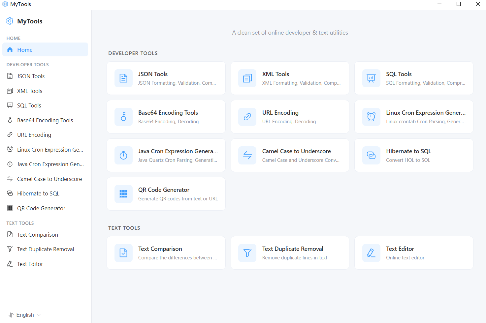

# MyTools

A collection of everyday developer and text utilities, available as a web app and as a native desktop app built with Wails 3 (Go + Vue 3).

  

## Features

**Developer tools**

- JSON / XML / SQL formatter and validator
- Base64 encode & decode
- URL encode & decode
- Crontab expression parser and preview (Linux crontab & Java/Spring scheduled)
- CamelCase ⇄ under_score converter
- Hibernate HQL to SQL preview
- QR code generator

**Text tools**

- Side-by-side text comparison (with file loading)
- Text deduplication (one entry per line)
- Quick text editor

Multi-language UI: English, 简体中文, 日本語, 한국어, Español, Tiếng Việt.

Desktop builds are available for Windows (x64 / x86 / ARM64), Linux (amd64 / arm64) and macOS (Apple Silicon).
